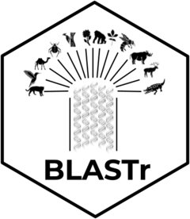

<!-- README.md is generated from README.Rmd. Please edit that file -->

# BLASTr: Parallel Taxonomic Classification of Metabarcoding Sequences <a href="https://heronoh.github.io/BLASTr/"></a>

<!-- badges: start -->

[](https://github.com/heronoh/BLASTr/actions/workflows/R-CMD-check.yaml)
<!-- [](https://CRAN.R-project.org/package=BLASTr) -->
<!-- badges: end -->

## Overview

`BLASTr` is an R package that seamlessly integrates BLAST+ searches into
your R workflow. It is specifically designed for the analysis of
Amplicon Sequence Variants (ASVs) from metabarcoding and metagenomic
studies. With `BLASTr`, you can efficiently perform taxonomic
classification of your sequences by leveraging the power of parallel
processing and automated dependency management.

## Features

- **Parallel BLAST Searches:** Run multiple BLAST searches concurrently
  to significantly speed up your analysis.
- **Automated Dependency Management:** `BLASTr` automatically installs
  and manages BLAST+ and Entrez Direct dependencies using `condathis`,
  ensuring a hassle-free setup.
- **Taxonomic Classification:** Retrieve detailed taxonomic information
  for your sequences using their NCBI Taxonomy IDs.
- **Flexible and Easy to Use:** The package provides a set of intuitive
  functions that simplify the process of running thousands of BLAST
  searches and handling the results.
- **Reproducible Research:** By managing dependencies in isolated Conda
  environments, `BLASTr` helps ensure that your analyses are
  reproducible.

## Installation

You can install the development version of `BLASTr` from GitHub with:

``` r
# install.packages("devtools")
devtools::install_github("heronoh/BLASTr")
```

## Basic Usage

Here’s a simple example of how to use `BLASTr` to perform a BLAST search
and retrieve taxonomic information:

``` r
library(BLASTr)

# First, make sure you have the necessary dependencies installed
install_dependencies()

# A vector of ASV sequences
asvs <- c(
  "CTAGCCATAAACTTAAATGAAGCTATACTAAACTCGTTCGCCAGAGTACTACAAGCGAAAGCTTAAAACTCATAGGACTTGGCGGTGTTTCAGACCCAC",
  "CTAGCCATAAACTTAAATGAAGCTATACTAAACTCGTTCGCCAGAGTACTACAAGTGAAAGCTTAAAACTCATAGGACTTGGCGGTGTTTCAGACCCAC",
  "GCCAAATTTGTGTTTTGTCCTTCGTTTTTAGTTAATTGTTACTGGCAAATGACTAACGACAAATGATAAATTACTAATAC",
  "AACATTGTATTTTGTCTTTGGGGCCTGGGCAGGTGCAGTAGGAACTTCACTTAGAATAATTATTCGTACTGAGCTTGGGCATCCAGGAAGACTTATCGGGGATGATCAAATCTATAATGTAATTGTTACAGCACATGCATTTGTGATAATTTTTTTTATAGTAATACCTATTATGATT",
  "XXXXAAANNN",
  "ACTATACCTATTATTCGGCGCATGAGCTGGAGTCCTAGGCACAGCTCTAAGCCTCCTTATTCGAGCCGAGCTGGGCCAGCCAGGCAACCTTCTAGGTAACGACCACATCTACAACGTTATCGTCACAGCCCATGCATTTGTAATAATCTTCTTCATAGTAATACCCATCATAATCGGAGGCTTTGGCAACTGACTAGTTCCCCTAATAATCGGTGCCCCCGATATG",
  "TTAGCCATAAACATAAAAGTTCACATAACAAGAACTTTTGCCCGAGAACTACTAGCAACAGCTTAAAACTCAAAGGACTTGGCGGTGCTTTATATCCAC"
)

# Path to your local BLAST database
db_path <- fs::path_package("BLASTr", "extdata", "minimal_db_blast", ext = "fasta")

head(readLines(db_path))
#> [1] ">AP011979.1 Gymnotus carapo mitochondrial DNA, almost complete genome"           
#> [2] "TACAAACTGGGATTAGATACCCCACTATGCCTAGCCATAAACTTAAATGAAACTATACTAAACTCATTCGCCAGAGTACT"
#> [3] "ACAAGCGAAAGCTTAAAACTCAAAGGACTTGGCGGTGTTTCAGACCCAC"                               
#> [4] ">CP030121.1 Brasilonema octagenarum UFV-E1 chromosome"                           
#> [5] "TAGCTCCCGTCGAGTCTCTGCACCTTCCGCATTAGTCATTTATCATTTGTCGTTAGTCATTTGCTAGTAACAATTAACTA"
#> [6] "AAAACGAAGGACAAAAGACAAATTTGGC"
```

``` r
# Run BLAST in parallel
blast_results <- parallel_blast(
  asvs = asvs,
  db_path = db_path,
  total_cores = 2 # Number of cores to use
)

# Extract the taxonomy IDs from the BLAST results
tax_ids <- blast_results$`1_staxid`

# Retrieve taxonomic information in parallel
taxonomic_info <- parallel_get_tax(
  organisms_taxIDs = tax_ids,
  total_cores = 2
)
#> retrying 0 of 10
#> ------------------------> unable to retrieve taxonomy for: N/A   
#> ------------------------> unable to retrieve taxonomy for: NA    
#> retrying 1 of 10
#> ------------------------> unable to retrieve taxonomy for: N/A   
#> ------------------------> unable to retrieve taxonomy for: NA    
#> retrying 2 of 10
#> ------------------------> unable to retrieve taxonomy for: N/A   
#> ------------------------> unable to retrieve taxonomy for: NA    
#> retrying 3 of 10
#> ------------------------> unable to retrieve taxonomy for: N/A   
#> ------------------------> unable to retrieve taxonomy for: NA    
#> retrying 4 of 10
#> ------------------------> unable to retrieve taxonomy for: N/A   
#> ------------------------> unable to retrieve taxonomy for: NA    
#> retrying 5 of 10
#> ------------------------> unable to retrieve taxonomy for: N/A   
#> ------------------------> unable to retrieve taxonomy for: NA    
#> retrying 6 of 10
#> ------------------------> unable to retrieve taxonomy for: N/A   
#> ------------------------> unable to retrieve taxonomy for: NA    
#> retrying 7 of 10
#> ------------------------> unable to retrieve taxonomy for: N/A   
#> ------------------------> unable to retrieve taxonomy for: NA    
#> retrying 8 of 10
#> ------------------------> unable to retrieve taxonomy for: N/A   
#> ------------------------> unable to retrieve taxonomy for: NA    
#> retrying 9 of 10
#> ------------------------> unable to retrieve taxonomy for: N/A   
#> ------------------------> unable to retrieve taxonomy for: NA    
#> The following taxIDs could not be retrieved even after 10 attempts:
#> N/AThe following taxIDs could not be retrieved even after 10 attempts:
#> NA
```

``` r
# View the results
print(blast_results)
#> # A tibble: 7 × 57
#>   Sequence               `1_subject header` `1_subject` `1_indentity` `1_length`
#>   <chr>                  <chr>              <chr>               <dbl>      <dbl>
#> 1 CTAGCCATAAACTTAAATGAA… "Gymnotus carapo … AP011979.1           97.0         99
#> 2 CTAGCCATAAACTTAAATGAA…  <NA>              <NA>                 NA           NA
#> 3 GCCAAATTTGTGTTTTGTCCT… "Brasilonema octa… CP030121.1           96.2         78
#> 4 AACATTGTATTTTGTCTTTGG… "Symphoromyia cra… MG967958.1           84.9        179
#> 5 XXXXAAANNN              <NA>              <NA>                 NA           NA
#> 6 ACTATACCTATTATTCGGCGC… "Homo sapiens iso… MN849868.1          100          226
#> 7 TTAGCCATAAACATAAAAGTT… "Hydrochoerus hyd… KX381515.1           99.0         99
#> # ℹ 52 more variables: `1_mismatches` <dbl>, `1_gaps` <dbl>,
#> #   `1_query start` <dbl>, `1_query end` <dbl>, `1_subject start` <dbl>,
#> #   `1_subject end` <dbl>, `1_e-value` <dbl>, `1_bitscore` <dbl>,
#> #   `1_qcovhsp` <dbl>, `1_staxid` <chr>, `2_subject header` <chr>,
#> #   `2_subject` <chr>, `2_indentity` <dbl>, `2_length` <dbl>,
#> #   `2_mismatches` <dbl>, `2_gaps` <dbl>, `2_query start` <dbl>,
#> #   `2_query end` <dbl>, `2_subject start` <dbl>, `2_subject end` <dbl>, …
print(taxonomic_info)
#> # A tibble: 0 × 13
#> # ℹ 13 variables: Sci_name <chr>, query_taxID <chr>, Superkingdom (NCBI) <chr>,
#> #   Kingdom (NCBI) <chr>, Phylum (NCBI) <chr>, Subphylum (NCBI) <chr>,
#> #   Class (NCBI) <chr>, Subclass (NCBI) <chr>, Order (NCBI) <chr>,
#> #   Suborder (NCBI) <chr>, Family (NCBI) <chr>, Subfamily (NCBI) <chr>,
#> #   Genus (NCBI) <chr>
```

## Main Functions

- `install_dependencies()`: Installs BLAST+ and Entrez Direct if they
  are not found on your system.
- `parallel_blast()`: Runs BLAST searches for multiple sequences in
  parallel.
- `get_blast_results()`: Runs a BLAST search for a single sequence.
- `parallel_get_tax()`: Retrieves taxonomic information for multiple
  NCBI Taxonomy IDs in parallel.
- `get_tax_by_taxID()`: Retrieves taxonomic information for a single
  NCBI Taxonomy ID.
- `run_blast()`: A lower-level function to run a BLAST search and return
  the raw output.
- `parse_fasta()`: Extracts sequences from a FASTA file.
- `get_fasta_header()`: Retrieves the full header of a sequence from a
  BLAST database.

## Dependency Management

`BLASTr` uses the `condathis` package to manage its dependencies (BLAST+
and Entrez Direct). When you run a function that requires one of these
tools, `BLASTr` will automatically check if it’s installed. If not, it
will create a Conda environment and install the necessary software. This
ensures that you always have the correct versions of the dependencies
without having to install them manually.

You can control the installation process with the `force` and `verbose`
arguments in the `install_dependencies()` and `check_cmd()` functions.

## Contributing

Contributions are welcome! Please see the [contributing
guide](.github/CONTRIBUTING.md) for more details.

## License

This project is licensed under the MIT License - see the
[LICENSE](LICENSE) file for details.
